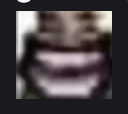
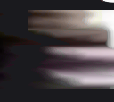

    

# Parallel GPU Pixel Sorting

A simple compute shader for sorting pixels of an image using the Metal Shader Langauge.
(Mainly used for studying purposes)

## Example

  

    
<strong>Original Image</strong>

    
  

  →
  

    
<strong>Sorted Result</strong>

    
  

